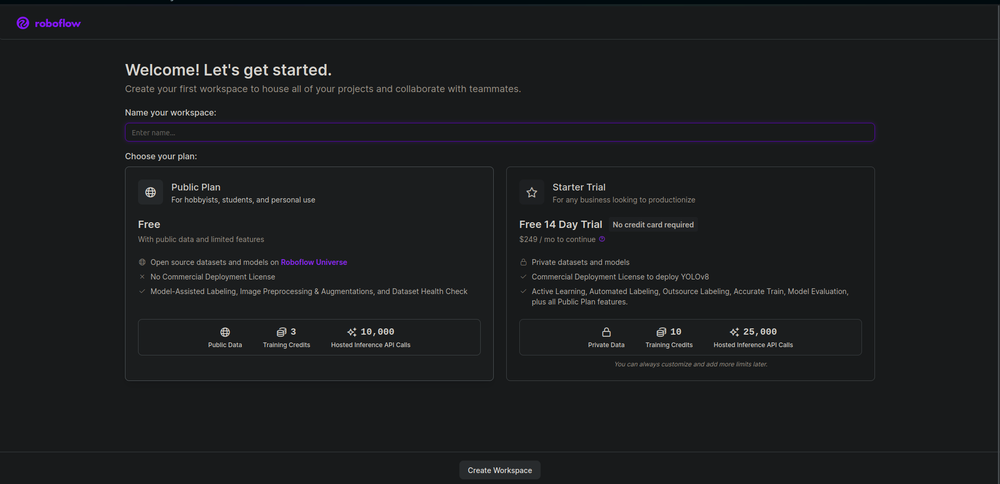
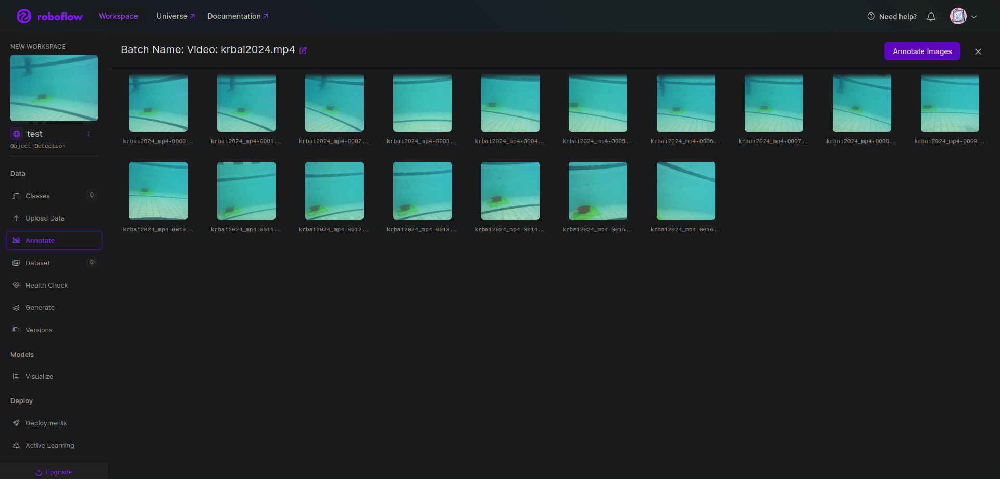
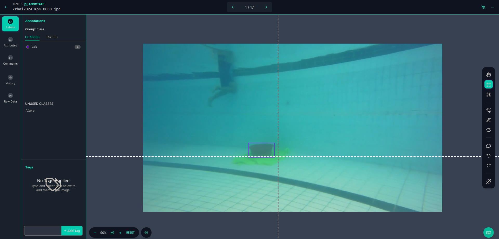
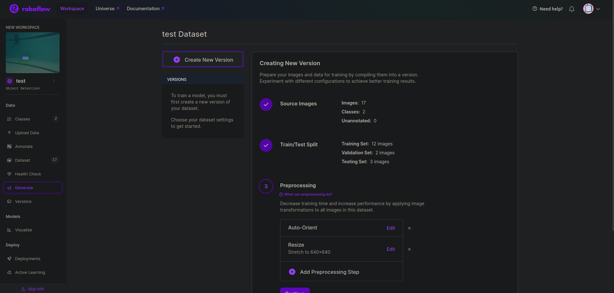
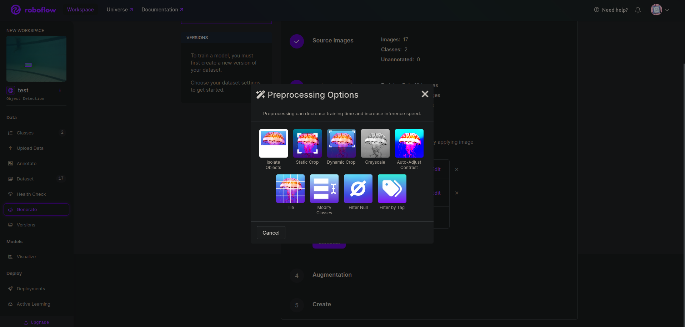
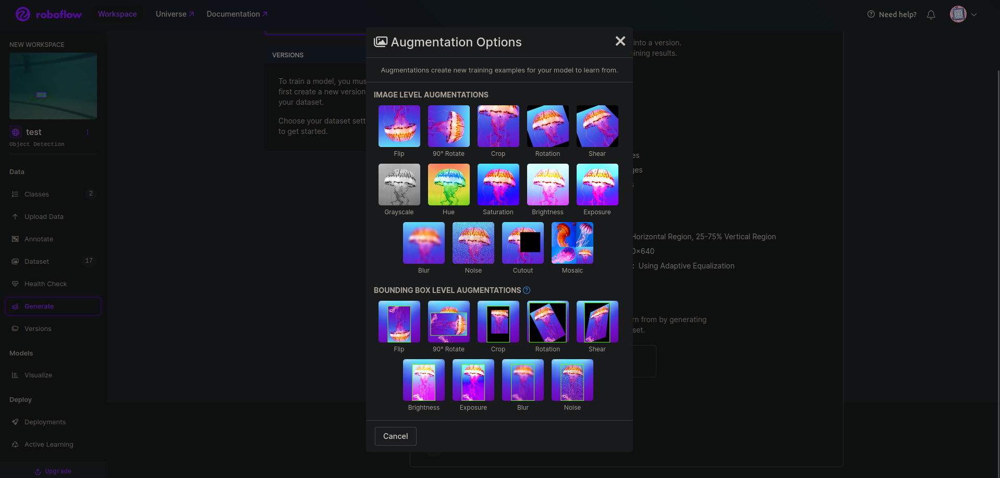
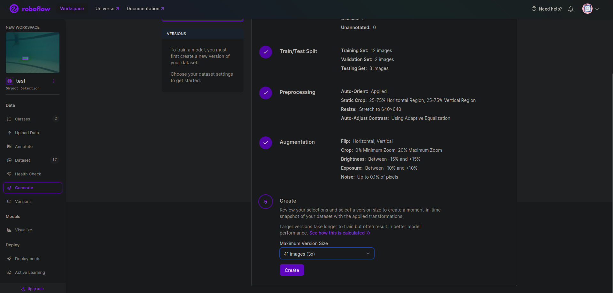
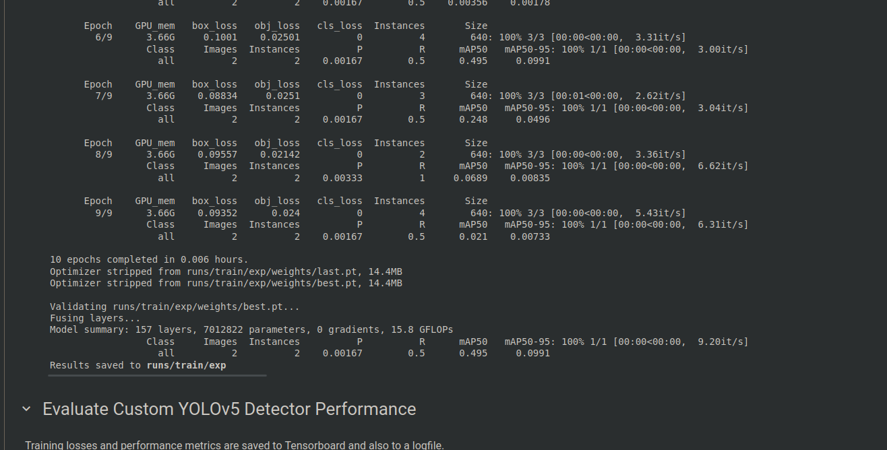
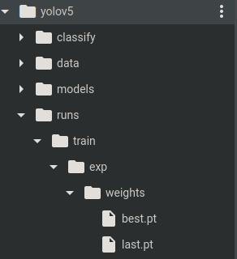

# Daftar Isi
- [Daftar Isi](#daftar-isi)
- [OpenCV](#opencv)
  - [Instalasi](#instalasi)
  - [Konsep](#konsep)
    - [Dasar OpenCV](#dasar-opencv)
    - [Color Spaces](#color-spaces)
    - [Operasi Basic](#operasi-basic)
    - [Operasi Aritmetik](#operasi-aritmetik)
- [YOLO](#yolo)
  - [Convolutional Neural Network (CNN)](#convolutional-neural-network-cnn)
  - [Pengenalan YOLO](#pengenalan-yolo)
    - [Two-Stage Detector](#two-stage-detector)
    - [One-Stage Detector](#one-stage-detector)
  - [Instalasi](#instalasi-1)
  - [Konsep](#konsep-1)
  - [Pembuatan Dataset dengan Roboflow \& Training](#pembuatan-dataset-dengan-roboflow--training)
  - [Integrasi dengan ROS2](#integrasi-dengan-ros2)
  - [YOLO di C++](#yolo-di-c)

# OpenCV

Apa itu OpenCV? OpenCV merupakan sebuah library yang bisa kita gunakan untuk melakukan pengolahan gambar, video, atau **pengolahan dari kamera secara realtime**. OpenCV bersifat open-source, dan bisa digunakan untuk mengolah citra yang dikonversi dari analog ke digital sehingga kita bisa melakukan operasi-operasi pengolahan citra. Pemrosesan gambar bisa membantu kita untuk melakukan perbaikan kualitas gambar, menghilangkan noise, identifikasi gambar, deteksi warna, dan lain-lain.

## Instalasi

**Python**

Untuk OpenCV versi python bisa langsung diinstall memakai package manager apt, seperti berikut:

```bash
sudo apt install python3-opencv -y
```

**C++**

Untuk OpenCV C++ bisa memakai library ataupun install dari source. Untuk memudahkan kita hanya akan cover bagian library.

```bash
sudo apt install libopencv-dev -y
```

## Konsep

### Dasar OpenCV

**Read, Display, Write Image**

Read - Pembacaan suatu gambar dilakukan dengan fungsi imread().

```c++
imread(filename, flags)
```

- filename: berisi path ke file gambar
- flags: opsional, berisi argumen-argumen yang membuat pemrosesan gambar lebih spesifik

Display - Jika ingin menampilkan suatu gambar, bisa dilakukan dengan fungsi imshow().

```c++
imshow(windowname, image)
```

- windowname: berisi nama window yang akan ditampilkan
- image: berisi path ke variabel (Mat) gambar

Write - Penulisan suatu gambar dilakukan dengan fungsi imread().

```c++
imwrite(filename, image)
```

- filename: berisi path untuk melakukan save
- image: berisi path ke variabel (Mat) gambar

**Penggunaan**

Berikut adalah penggunaan sederhana dari OpenCV yang menggunakan fungsi-fungsi diatas.

```c++
// library
#include<opencv2/opencv.hpp>
#include<iostream>

// namespaces
using namespace std;
using namespace cv;

Mat img_grayscale = imread("test.jpg", 0); // read
imshow("grayscale image", img_grayscale); // display

waitKey(0); // wait for a keystroke
destroyAllWindows(); // Destroys all the windows created

imwrite("grayscale.jpg", img_grayscale); // write
```

### Color Spaces

**BGR**

<div align="center">

</div>

Format BGR merupakan format default yang digunakan oleh OpenCV untuk membaca dan menulis gambar. Color space ini memiliki elemen:
1. Blue
2. Green
3. Red

**RGB**

Sama dengan BGR. Bedanya, posisi _channel_ B dan R ditukar. Format ini merupakan format yang banyak perangkat gunakan untuk membaca dan mengeluarkan gambar. Color space ini memiliki elemen:
1. Red
2. Green
3. Blue

**HSV**

<div align="center">
<div style="background-color: white; max-width: 24em;">

</div>
</div>

Berbeda dengan Color space lainnya, HSV hanya menggunakan satu _channel_ (Hue) untuk mendeskripsikan warna dan channel lainnya menggunakan warna. Biasanya color space ini berguna untuk menentukan warna tanpa dipengaruhi oleh cahaya.

**Grayscale**

<div align="center">

</div>

Grayscale memperhitungkan semua aspek gambar dalam satu channel. Biasanya color space ini digunakan apabila tujuan pemrosesan gambar tidak memperhitungkan warna.

### Operasi Basic

https://docs.opencv.org/3.4/d3/df2/tutorial_py_basic_ops.html

### Operasi Aritmetik

https://docs.opencv.org/3.4/d0/d86/tutorial_py_image_arithmetics.html

# YOLO

## Convolutional Neural Network (CNN)

CNN merupakan sebuah algoritma _deep learning_ yang bertujuan untuk mempelajari data spatial (seperti gambar, objek 3D, dan video)

### Basics

**Tensor** merupakan matriks berdimensi-N. Dalam CNN gambar, biasanya memiliki Tensor 3 dimensi (_channel_, _height_, _width_) sebagai input.

**Neuron** merupakan sebuah fungsi yang memiliki berbagai input dan mengeluarkan suatu output.

**Weights dan bias** merupakan parameter (seperti koefisien dan konstanta) dalam setiap neuron. Parameter ini lah yang akan berubah dan "belajar".

**Layer** merupakan sekumpulan neuron yang melakukan suatu operasi yang sama.

### Convolutional Layer

Layer ini melakukan proses konvolusi pada input yang diberikan. Konvolusi merupakan proses perhitungan iteratif kernel pada setiap posisi dalam gambar.

<div align="center">

</div>

### Pooling Layer

Pooling layer bertujuan untuk mereduksi ukuran data yang akan dikeluarkan dan mengurangi biaya komputasi dengan menggunakan kernel. Terdapat berbagai cara untuk melakukan hal tersebut, seperti mengambil nilai terbesar (Max pooling) dan mengambil rata-rata (Average pooling).

<div align="center">

</div>

### Fully Connected Layer

Fully connected layer dapat diibaratkan seperti struktur otak, dimana setiap neuron terhubung dengan setiap neuron di layer selanjutnya.

<div align="center">

</div>

### Activation

Fungsi aktifasi menentukan transformasi akhir keluaran sebuah neuron.

<div align="center">

</div>

### Visualizer

Penjelasan lebih lanjut dan visualisasi CNN dapat dilihat di [visualizer ini](https://poloclub.github.io/cnn-explainer/)

## Pengenalan YOLO

<div align="center">

</div>

### Two-Stage Detector

Dalam Two-Stage Detector, proses prediksi terdiri dari 2 fase, yakni:
1. _Region Proposal Network_ membuat sebuah proposisi yang menentukan lokasi berpotensi objek dalam gambar
2. Proposisi tersebut dimasukkan ke dalam sebuah _classifier_ atau _regressor_ yang akan menyempurnakan _bounding box_

Contoh dari Two-Stage Detector adalah R-CNN, Fast R-CNN, Faster R-CNN.

### One-Stage Detector

Dalam One-Stage Detector, proses prediksi dilaksanakan secara langsung, dimana gambar langsung diprediksi tanpa adanya pembuatan proposisi. 

Contoh dari One-Stage Detector adalah SSD (Single Shot Multibox Detector), RetinaNet dan YOLO (You Only Look Once)

## Instalasi

Dalam contoh kali ini, kita akan menggunakan model YOLOv5

**Prerequisite**

```bash
sudo apt update
sudo apt install python3
sudo apt install python3-pip
```

**YOLOv5**

```bash
git clone https://github.com/ultralytics/yolov5
cd yolov5
pip install -r requirements.txt 
```

**YOLOv8**

```bash
pip install opencv-python
pip install supervision
pip install ultralytics
```

## Konsep

**Penggunaan v5**

YOLOv5 merupakan versi YOLO yang cukup tua namun masih populer hingga saat ini karena akurasinya yang tinggi dengan inferensi yang cepat. Biasanya model ini digunakan dalam aplikasi realtime.

**Penggunan v8**

YOLOv8 merupakan versi YOLO lebih baru lagi yang memiliki akurasi yang lebih tinggi serta fungsi-fungsi yang disediakan selain object detection, seperti instance segmentation dan pose estimation. Biasanya YOLOv8 digunakan apabila tujuan model bukan merupakan object detection atau akurasi lebih penting dibanding kecepatan.

## Pembuatan Dataset dengan Roboflow & Training

**Pembuatan**

Contoh penggunaan YOLOv5/v8 diatas menggunakan dataset bawaan dari YOLO. Untuk melakukan deteksi terhadap objek-objek khusus yang kita inginkan, kita perlu untuk membuat dataset sendiri. Kita bisa menggunakan website [Roboflow](https://roboflow.com/) sebagai framework pembuatan dataset. (NOTE: Perlu membuat akun)

Pertama, kita perlu mengambil data sample dari objek yang kita ingin masukkan ke dataset. Sample dapat berupa gambar/video, tetapi disarankan menggunakan video, karena nanti akan dipecah per fps yang kita pilih. Kemudian, kita masuk ke [Roboflow](https://app.roboflow.com/) dan kita upload gambar/video yang kita sudah ambil.



Jika kalian berhasil membuat akun, akan masuk ke page diatas. Disini kita bisa membuat workspace, misal `Banyubramanta`. (Pilih public plan, skip invite teammates untuk sekarang)


Setelah membuat workspace, kalian akan membuat project. Untuk nama project terserah, misal `test`. Untuk annotation group karena tidak boleh kosong, samakan saja dengan objek yang ingin kalian deteksi.


Sekarang kalian bisa mengupload video kalian. Karena ini hanya untuk keperluan pembelajaran, tidak perlu image hasil pecahan yang banyak, jadi bisa coba setting frame rate yang outputnya menghasilkan 15-30 image saja.



Masuk ke tahap paling seru (nuh uh), annotation/labelling data (Tab `Annotate`). Sekarang kalian akan secara manual melakukan labelling dataset yang sudah kalian upload. Kalian bisa memulai dari image pertama.



Karena YOLO bekerja dengan bounding boxes, maka kita pun melakukan labelling data dengan bounding box. Pastikan bounding box yang kalian buat akurat, karena itu akan mempengaruhi kinerja YOLO nantinya.

Untuk class, misal kalian hanya deteksi satu objek, maka tidak perlu membuat banyak class, cukup class untuk objek itu saja. Tetapi misal kalian ingin mendeteksi banyak objek, maka kalian perlu membuat class yang sesuai dengan objek kalian dan melakukan labelling dengan banyak class. Misal kalian sudah selesai melakukan labelling, maka kalian bisa menambahkannya ke dataset dengan tombol `Add n images to dataset`.


Untuk konfigurasi ini kalian bisa bereksperimen, tetapi kombinasi 70-15-15 merupakan salah satu kombinasi yang bisa kalian coba.



Sekarang kalian bisa melakukan generate dataset (Tab `Generate`). Jika kalian sudah melakukan tahap labelling dengan benar, dua point pertama seharusnya sudah selesai. Kalian sekarang bisa menambahkan preprocessing dan augmentation yang kalian inginkan.





Jika sudah memilih preprocessing & augmentation yang kalian inginkan, sekarang kalian bisa membuat dataset dari gambar/video kalian.


Sekarang kalian lanjut ke tahap **training** dataset yang kalian buat!

**Training**

Kalian bisa memilih opsi `custom train and upload` di page versions. Kalian bisa memilih antara YOLOv5/v8, tetapi disarankan mencoba YOLOv5 dulu (lebih ringan). Seharusnya kalian akan mendapatkan code snippet yang bisa dimasukkan ke Jupyter Notebook untuk training. Setelah ini, kalian bisa masuk ke sini:

[Custom Training with YOLOv5](https://colab.research.google.com/github/roboflow-ai/yolov5-custom-training-tutorial/blob/main/yolov5-custom-training.ipynb)

Code snippet yang kalian dapatkan tadi bisa dimasukkan di sini: (untuk dua code block diatas bisa dihapus)


Kemudian kalian bisa run command dibawahnya, yaitu:

```jupyter
!python train.py --img 640 --batch 16 --epochs 10 --data {dataset.location}/data.yaml --weights yolov5s.pt --cache
```

Untuk img bawaan 416, bisa kalian ganti ke dimensi sesuai dataset kalian. Untuk epoch bawaan 150, itu memakan waktu lama dan cocok ke dataset yang besar, jadi kalian bisa memakai epoch +-10. Jika sukses maka akan muncul model yang telah ditrain.




Kalian bisa download file `best.pt` karena itu file hasil training ini. Sekarang kalian bisa menggunakannya di program YOLO kalian. Misal kalian ingin mencoba dengan program bawaan YOLO, bisa dengan command berikut:

```python
python3 detect.py --weights <path_file.pt> --source 0
```

Untuk YOLOv8, kalian bisa mengganti path ke file .pt kalian.

```python
model = YOLO("<path__file.pt>")
```

## Integrasi dengan ROS2

Untuk mengintegrasi model kalian dengan ROS, kalian dapat mengirimkan gambar lewat sebuah topic dalam bentuk `sensor_msgs/msg/Image` dan membuat gambar tersebut sebagai masukan dari model YOLO.

Terdapat banyak cara untuk membuka dan membaca file model YOLO kita, seperti menggunakan `cv::dnn`. Namun, kita akan menggunakan OpenVINO (Open Visual Inference and Neural Network Optimization) dengan alasan:
- OpenVINO menyediakan hardware support Intel bagi berbagai macam AI
- Mini PC kita menggunakan hardware Intel
- Intel supremacy

## Tugas
