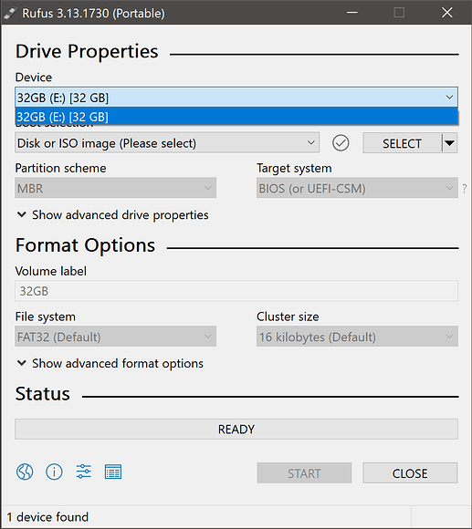

# Welcome!

Selamat datang para calon-calon Crew 8 Banyubramanta, ini adalah modul Open Recruitment untuk mempersiapkan kalian terhadap tugas-tugas di Banyubramanta nantinya. Selamat belajar!

## Learning Tree

| Materi                    | Keterangan |
|---------------------------|------------|
|ROS2      | Framework programming robot, inti dari inti |
|OpenCV    | Digunakan untuk algoritma color detection |
|YOLO      | Digunakan untuk algoritma image detection |
|Serial Communication | Komunikasi antar robot ke microcontroller STM32 |
|Behavior Tree | Sistem untuk menentukan program yang berjalan di robot yang berbentuk tree|
|GAZEBO | Program simulasi robot (sering digunakan karena robot kita dibawah air)

# Ubuntu

## Prerequisites

Karena kita menggunakan framework dan program diatas, kita memerlukan OS **Ubuntu**. Ubuntu yang dipakai yaitu Ubuntu 22.04 (Jammy Jellyfish) dikarenakan kecocokannya dengan versi ROS2 yang akan kita pakai nantinya.

Ubuntu yang digunakan bisa Ubuntu biasa (berbasis GNOME), Kubuntu (berbasis KDE), Xubuntu (berbasis XFCE), Lubuntu (low-end friendly - LXQt).

Untuk melakukan install Ubuntu sebenarnya ada berbagai cara, tetapi kita menggunakan **Dual Boot** (wajib). Jadi ada beberapa hal yang diperlukan seperti:

- Device kalian
- Flashdisk / filesystem (omagad sisop) flash lainnya (8GB+)
- Rufus / aplikasi lain yang bisa membuat `.iso` masuk ke USB drive kalian dan menjadi sebuah bootable USB drive.

### Install file .iso (Image Ubuntu)

Kalian bisa memilih distro Ubuntu kalian dulu. (ingat pakai Ubuntu 22.04, file bisa ditaruh dimanapun)

- Ubuntu: https://releases.ubuntu.com/jammy/
- Kubuntu: https://kubuntu.org/getkubuntu/
- Lubuntu: https://lubuntu.me/downloads/
- Xubuntu: https://xubuntu.org/download/

### Install Rufus
Kalian bisa install Rufus melalui link ini (versi bebas, disarankan versi 3.13.*): https://rufus.ie/en/

**~~beli flashdisk~~** misal kalian tidak punya, atau ingin langsung install Ubuntu biasa bisa minta ke kita :grinning:

### Input .iso ke flashdisk

1. Insert flashdisk ke device kalian.
2. Buka rufus (bisa installer bisa portable)

3. Select .iso Ubuntu, klik START, Write in ISO image mode

> !!!! FILE FLASHDISK AKAN DIFORMAT, JIKA PENTING BACKUP DULU !!!!

### Restart device dengan kondisi USB plugged in

Setelah membuat bootable USB drive, kalian bisa restart laptop kalian dan masuk ke UEFI (bisa melalui Settings > Startup > Advanced Start-Up), kemudian pilih USB drive kalian untuk di-boot.

Setelah kalian masuk, seharusnya kalian ada di welcome screen Ubuntu.

### Install Ubuntu

Disarankan memakai minimal installation untuk meminimalisir bloatware.

Terdapat 2 pilihan untuk instalasi Ubuntu:

1. Install Ubuntu alongside Windows Boot Manager
2. Membuat partisi

Pilihan 1 merupakan pilihan yang simple, tetapi misal kalian suatu saat ingin menghapus Ubuntu, Windows akan ikut terhapus, jadi sustainabilitynya kurang (emang bakal dihapus tapi?)

Pilihan 2 lumayan rumit, karena kalian harus memecah free disk space kalian menjadi beberapa part, untuk pilihan ini bisa melihat video berikut:
https://www.youtube.com/watch?v=Fjy4gUB_asM

**Disarankan set partisi/ukuran Linux sebesar 80GB+, kalau bisa 100GB+ karena kemungkinan besar materi di perkuliahan kalian (jika FTEIC) akan memakai Linux nantinya, dan ini akan mempermudah kalian sehingga tidak perlu melakukan resize (speaking from experience) (resize 4 kali)**

Kemudian lanjutkan proses instalasi kalian, dan...

### Selesai!

Kalian sekarang bisa switch antara Windows dan Linux setiap kali kalian boot.

# Git

Singkatnya, Git merupakan sebuah alat untuk para developer (kita, dan kalian) gunakan untuk saling berkolaborasi. GitHub/GitLab merupakan service yang membuat repository kalian di host di cloud, yang memungkinan kolaborasi yang efektif.

Sebelum itu, kalian bisa melihat tutorial Git/GitHub agar kalian bisa memahami cara menggunakan Git untuk di Banyubramanta nantinya di link berikut:
[W3Schools - Git Tutorial](https://www.w3schools.com/git/)

Link diatas mencakup bagian yang paling dipakai di Git, yang tentunya nanti kalian akan paling banyak pakai juga. Tetapi ada beberapa note, yaitu:

- Pakai git pull --rebase, jangan git pull biasa: commit history lebih clean
- **Jangan pakai -f untuk melakukan apapun. -f berarti force, yang akan melakukan command yang kalian pakai dengan paksa: menghilangkan commit history**
- Penggunaan submodules
  - Misalkan kalian sedang mengerjakan sesuatu, dan kemudian kode kalian butuh kode orang lain. Kalian git clone ke repo kalian.
  - Misal memakai git clone, kalau di push tidak akan masuk. Sehingga ada namanya git submodules.
  - Submodules berguna untuk membuat suatu repository menjadi subrepository di repository lain.
  - Memakai git submodule memungkinan kalian untuk membuat kode orang lain menjadi bagian dari kode kalian, dan bisa diclone oleh orang lain.
  - Untuk penjelasan lebih lengkap terkait submodules ada di [sini](https://git-scm.com/book/en/v2/Git-Tools-Submodules).

Sekarang kalian bisa melanjutkan ke ROS2~